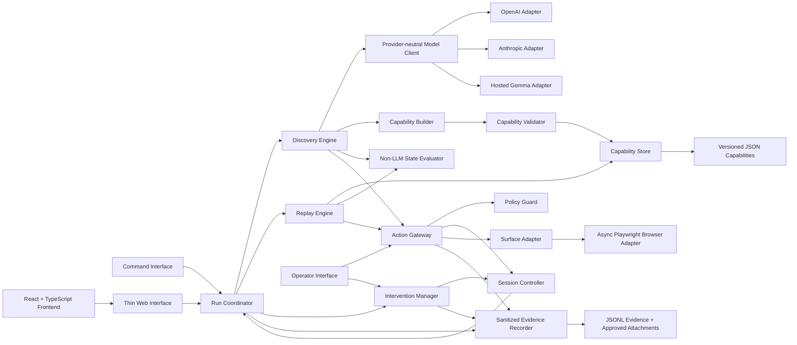

# Architecture

The runner uses one Python backend, a React client and a browser adapter.
Read [REPORT](../REPORT.md) for the short explanation of decisions and trade-offs,
or [system flow](submission/system-design.md) to follow a request.

## The boundaries to preserve

| Choice | Why it matters |
| --- | --- |
| Discovery uses a model; Replay does not. | Exploration and repeat execution need different levels of freedom. |
| Typed JSON artifact plus separate app profile. | Keep workflow meaning separate from concrete controls. |
| Action Gateway for all automation. | Apply the same policy and ownership rules in both modes. |
| Browser handles stay in the adapter. | Other modules should not depend on Playwright. |
| Session Controller owns control and generation. | Reject stale work and avoid racing the human. |
| Evidence is sanitized before storage. | Useful diagnostics should not require raw secrets. |

These remain **ACCEPTED BASELINE** decisions, not proof that every planned
extension exists. [Progress](progress.md) records completed verification.

## Current handoff exception and implementation status

The owner approved native human input after the original baseline below.
Physical clicks occur in the same retained browser outside Action Gateway;
automated actions still use it. Fresh state must validate handback.
The [native handoff record](subsystems/direct-browser-handoff.md) documents this
explicit amendment.

React, Discovery, Replay and the browser adapter are now implemented. The original
P1.0-only statements and planned interfaces below describe the initial design
stage. They do not override later authorization or establish current status.
Desktop, voice and Teach are not implemented.

Original architecture record: responsibilities, flows and design constraints

## Document status

This document describes the **ACCEPTED BASELINE**. It is architecture documentation, not evidence that components exist or behavior has been verified. Open choices are labeled **PROPOSED IMPLEMENTATION DETAIL**. Only completed tests recorded in `docs/progress.md` may be called **VERIFIED BEHAVIOR**.

P0 established the documentation baseline. P1.0 establishes repository/package structure and checks selected static boundaries; it does not implement application behavior, provider integration, browser execution, or run evidence.

The rationale, alternatives, assumption tests, and revisit conditions are in the [architecture decision register](adr/README.md).

The concrete layer-to-directory mapping, planned filenames, and static-check limits are in [repository-map.md](repository-map.md).

## System shape

The system is a modular monolith. Python modules expose typed Pydantic contracts inside one backend process. A command interface and a thin web interface invoke the same core. The product frontend is React and TypeScript and communicates through the thin web interface.

Production Python code lives in one `src/capability_runner/` package organized by accepted responsibility. Concrete dependency composition will live in `bootstrap.py` when P1.6 needs it; validated runtime configuration will live in `settings.py` when a consuming subsystem needs it. Neither file is created as a placeholder in P1.0. The React client remains under `web/` and cannot become a second execution engine. The synthetic `demo_app/` remains an external target and cannot be imported by production runner code.

Arrows show allowed high-level dependencies, not implementation completion. The diagram is normative about direction: interfaces may call the core, but the core must not import interface concerns; Replay Engine must not depend on Model Client or provider adapters; engines and Operator Interface must not dispatch surface actions around Action Gateway.

## Components and responsibilities

| Component | Accepted responsibility | Must not own |
| --- | --- | --- |
| Command Interface | Parse commands/configuration, invoke the backend core, and render structured results for local runs and evidence generation. | Discovery decisions, replay interpretation, policy, or direct browser actions. |
| Thin Web Interface | Expose the same backend operations and live run state needed by the product frontend and operator path. | A second execution implementation or business logic duplicated from the core. |
| React + TypeScript product frontend | Present run submission/status, intervention context, and the minimal Operator Interface. Later, it may host teaching features after authorization. | Policy decisions, raw secret persistence, or independent capability execution. |
| Run Coordinator | Coordinate lifecycle: create, start, pause, route, resume, stop, time out, and assemble run results. | Choosing individual discovery UI actions or resolving replay targets. |
| Discovery Engine | Run the LLM-driven observe-decide-act loop within stopping limits and policy; produce a successful trace for Capability Builder. | Publishing unvalidated capabilities or defining replay-time behavior outside the artifact. |
| Model Client | Provide a normalized discovery-facing model contract. | Replay, policy, storage, or provider-specific types outside adapters. |
| OpenAI, Anthropic, hosted Gemma adapters | Translate the normalized model contract to each configured provider and normalize responses/errors/capabilities. | Claiming feature parity without deployment probes. |
| Capability Builder | Transform a successful, sanitized discovery trace into a schema-supported candidate capability. | Preserving arbitrary transcript behavior or bypassing validation. |
| Capability Validator | Validate schema/version, parameter references, supported actions/conditions, targets, policy compatibility, and publication readiness. | Executing the capability or silently repairing an unsafe candidate. |
| Capability Store | Persist and retrieve typed, versioned JSON capability definitions under initial local file semantics. | Execution, policy approval, evidence capture, or concurrent distributed storage claims. |
| Replay Engine | Bind typed inputs, interpret ordered steps, resolve declared targets through a Surface Adapter, classify outcomes, verify checkpoints, and return a structured result without a model. | Importing or invoking Model Client, improvising unrecorded actions, or treating business outcomes as crashes. |
| Non-LLM State Evaluator | Evaluate explicit checkpoints, pre/postconditions, business outcomes, recoverable conditions, and failure observations from normalized surface state. | Semantic model calls or open-ended UI reasoning. |
| Action Gateway | Enforce the order of ownership/freshness and policy checks, dispatch authorized typed actions, and emit sanitized action evidence. | Selecting the next action, evaluating an entire flow, or becoming a second Run Coordinator. |
| Policy Guard | Enforce configurable target/domain/route and action-type allowlists; classify and conservatively gate risky/irreversible actions; apply sensitive-data restrictions. | Surface dispatch or model prompting. |
| Session Controller | Own live session identity, control owner/state, legal transitions, action freshness, and terminal cleanup coordination. | Assuming persisted metadata can restore a crashed browser. |
| Intervention Manager | Create, route, update, and resolve intervention requests with enough sanitized context for an operator. | Direct surface actions or implicit control transfer. |
| Operator Interface | Show the current live session/context, request control, submit human actions through Action Gateway, and explicitly resume or finish. | Opening a replacement session or bypassing Policy Guard. |
| Surface Adapter | Define normalized observation, target-resolution, action, evidence, and lifecycle contracts across surface types. | Model decisions or capability storage. |
| Async Playwright Browser Surface Adapter | Implement the initial real browser session, hybrid observations, validated browser targets, actions, and approved snapshots. | Making browser-specific assumptions part of every artifact contract. |
| Sanitized Evidence Recorder | Persist correlated, allowlisted JSONL events and approved bounded attachments after redaction. | Raw transcript/secret logging or deciding run outcomes. |

## Core flows

### Discovery and publication

1. Command or web interface submits a goal, target, limits, and policy context to Run Coordinator.
2. Run Coordinator creates the live session through Session Controller and the Browser Surface Adapter.
3. Discovery Engine requests a normalized observation and gives permitted context to Model Client.
4. A provider adapter returns a proposed typed action or completion claim.
5. Discovery Engine rejects actions that cannot identify a validated target or cannot be represented by the action language.
6. Action Gateway checks current control generation/owner, then Policy Guard, then dispatches through the adapter and records sanitized evidence.
7. Non-LLM State Evaluator evaluates explicit stop, outcome, and success conditions; the loop remains bounded by max steps and timeout.
8. On success, Capability Builder creates a candidate. Capability Validator either rejects it with reasons or permits Capability Store to persist it.
9. A successful discovery run is not automatically proof that the saved capability replays; replay evidence is separate.

### Deterministic replay

1. Run Coordinator loads a capability and validates its supported schema version and supplied inputs.
2. Replay Engine binds declared parameters. It has no Model Client dependency.
3. For each step, Replay Engine asks the adapter to resolve the declared target uniquely, then submits the prescribed action to Action Gateway.
4. Non-LLM State Evaluator classifies observations into success progress, a declared business outcome, a specifically recoverable condition, or a hard failure.
5. Recoverable behavior is bounded and predicate-driven. Risky actions are not retried after uncertain dispatch.
6. A terminal success requires the declared checkpoint and output extraction. The result reports success with typed outputs, a known business outcome, or a failure with step, expectation, and sanitized observation details.

### Intervention and same-session handoff

```mermaid
stateDiagram-v2
    [*] --> AUTOMATION_CONTROLLED
    AUTOMATION_CONTROLLED --> PAUSE_REQUESTED: escalation or approval needed
    PAUSE_REQUESTED --> OPERATOR_CONTROLLED: automation quiesced; transfer accepted
    OPERATOR_CONTROLLED --> RESUME_REQUESTED: operator hands back
    RESUME_REQUESTED --> AUTOMATION_CONTROLLED: state revalidated; new generation issued
    AUTOMATION_CONTROLLED --> TERMINAL: complete, failed, cancelled, or timed out
    OPERATOR_CONTROLLED --> TERMINAL: operator completes or cancels
    PAUSE_REQUESTED --> TERMINAL: timeout or cancellation
    TERMINAL --> [*]
```

State names are **illustrative** pending approval of PDI-001; the accepted requirement is an explicit inspectable state machine with exclusive ownership, legal transitions, and stale-action rejection.

During handoff, the existing Surface Adapter session remains alive. Intervention Manager supplies goal/capability, current step, reason, and approved current-state evidence. Operator Interface acquires control explicitly. Human actions traverse Action Gateway and are correlated in evidence with human provenance. On handback, State Evaluator revalidates the current state before automation receives a new freshness generation and resumes. Process crash recovery is outside what this state machine promises.

## Capability contract

The persisted capability is typed, versioned JSON and is decoupled from raw model messages. Its required concepts are:

- identity, schema version, description, provenance, and compatibility metadata;
- typed invocation inputs with sensitivity annotations and no real invocation values;
- typed outputs and declared business outcomes;
- ordered steps with supported actions, parameter bindings, validated target descriptions, pre/postconditions, and bounded recovery references;
- explicit success checkpoint and terminal failure information;
- policy-relevant risk metadata and review state where required;
- vendor-product compatibility plus separately managed tenant/version specialization data, rather than copied per-tenant flows.

The exact Pydantic unions, locator representation, schema migration rules, and retry predicates are **PROPOSED IMPLEMENTATION DETAIL** PDI-002 through PDI-004. Any future JSON example is illustrative until the artifact contract receives owner approval and tests.

## Result and error taxonomy

The accepted replay result has three top-level meanings:

| Meaning | Example | Engine behavior |
| --- | --- | --- |
| Success | Checkpoint reached and declared output extracted. | Return typed outputs plus run/evidence identifiers. |
| Known business outcome | Illustrative: a synthetic member record is not found or an input is rejected by business validation. | Return the declared outcome and typed details; do not report an infrastructure crash. |
| Failure | Target is ambiguous, permission is denied unexpectedly, session expires without an approved recovery, policy blocks an action, or an app error persists. | Stop or escalate with step, expectation, sanitized observation, and evidence reference. |

Recoverable conditions are explicit subpaths, not a fourth terminal result. Illustrative recoveries include bounded waiting for a known loading state or dismissing a known safe interstitial. Exact codes and retry limits remain PDI-004.

## Heterogeneity and tenant reuse

Capability semantics are separated from surface mechanics. An action describes supported intent and a target record; a Surface Adapter interprets the adapter-specific portion. The initial Playwright implementation exercises browser behavior. Future legacy-browser or desktop adapters must satisfy the same observation/action/outcome contract and pass adapter conformance tests before portability is claimed.

Capabilities are associated with a vendor product and compatible product/version range. Tenant configuration may supply approved entry points, branding aliases, locator overrides, and policy differences without editing the base flow. Resolution should prefer the base capability, apply a narrow version/tenant profile, validate targets in the tenant session, and fail closed on ambiguity. Exact precedence, fingerprinting, drift thresholds, and override schema remain unresolved public contract details and require approval before implementation.

Drift detection should compare declared compatibility and preflight observations, then record per-capability/per-variant replay results. It must not silently rewrite approved artifacts. Repeated failures may quarantine a variant and require validation or a specialized override. No multi-tenant reuse or drift behavior is verified.

## Safety and evidence invariants

- Every surface action, including a human action during handoff, goes through Action Gateway.
- Policy is explicit and configurable for targets/routes and action types; default behavior for unknowns is deny.
- Risky or irreversible actions require the configured conservative treatment. The exact approval contract is unresolved and must be approved before such actions are enabled.
- Inputs may be sensitive at invocation time, but artifacts store parameter definitions and bindings rather than real values.
- Credentials, tokens, and raw sensitive data must not be intentionally persisted in capabilities, JSONL, model transcripts, screenshots, snapshots, URLs, or errors.
- Evidence uses allowlisted structured fields and approved bounded attachments. Redaction occurs before persistence, not as later cleanup.
- Discovery prompts receive only the minimum sanitized state needed for the next decision.
- Stale, wrong-owner, out-of-policy, unsupported, and ambiguous actions fail closed.

These are design invariants, not verified claims. ADR-003 and ADR-008 define the tests required to support them.

## Phase gate

P1.0 authorizes repository/package configuration, side-effect-free subsystem package markers, repository/dependency checks, deferred-directory documentation, and status updates. It does not authorize P1.1 contracts or any later subsystem implementation.

After P1.0 review, the smallest next task is P1.1 core contracts and validation tests. It begins only with owner authorization. Required assignment execution remains ahead of optional teaching work.

