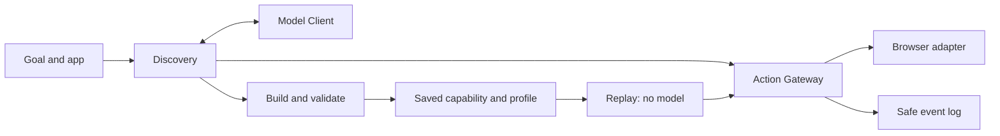
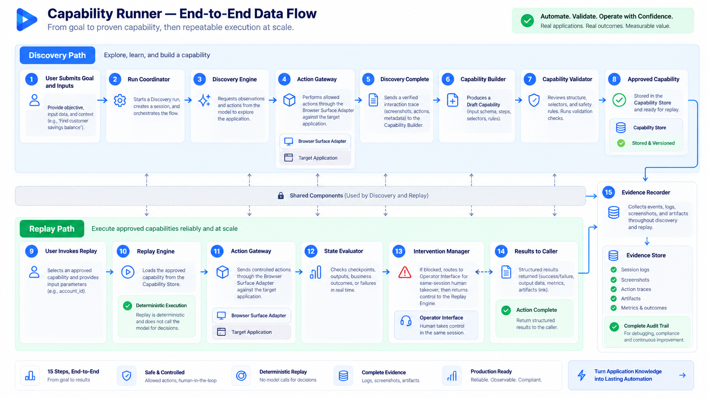
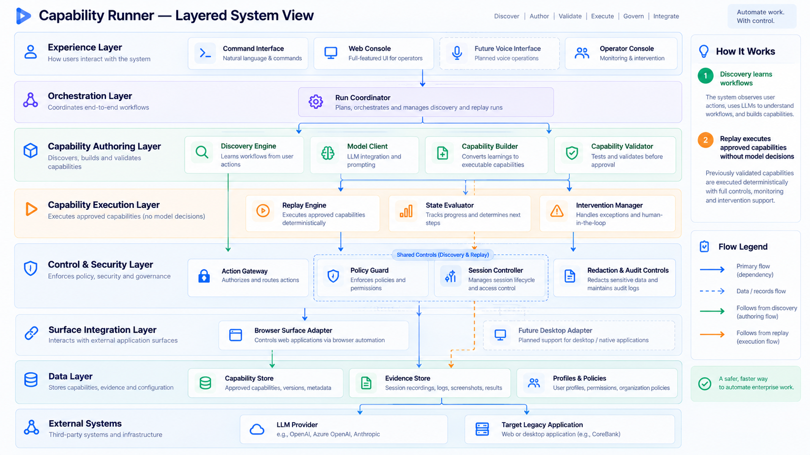
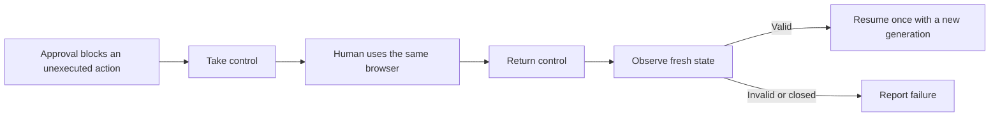

# How the runner works

Read [REPORT](../../REPORT.md) for the reasons behind these choices.
This page follows one request through the code.

## One workflow, two execution modes

**Discovery finds a procedure. Replay executes a saved procedure.**
Both use the same checks before automated actions reach the browser.

| Part | Its job | Boundary |
| --- | --- | --- |
| Discovery | Read the current page and ask the model for the next allowed action. | The model proposes; it cannot execute code. |
| Capability Builder / Validator | Turn a verified trace into a typed, valid artifact. | A completion claim alone cannot create a valid capability. |
| Replay / State Evaluator | Follow saved steps, check current state and return typed outputs. | No model calls or invented recovery steps. |
| Action Gateway | Check ownership, freshness and policy before dispatch. | Every automated action uses this path. |
| Browser Surface Adapter | Hold the live browser and resolve controls. | Playwright handles stay here. |
| Session Controller | Decide who owns the session and reject stale requests. | A UI button cannot grant itself authority. |
| Evidence Recorder | Write correlated, sanitized events. | It does not decide whether a goal succeeded. |

See the [repository map](../repository-map.md) for source locations.

## Architecture concept images

These are early design illustrations, not execution evidence. Labels such as
“production ready,” “approved capability,” “complete audit trail,” and learning
from user demonstrations exceed the current implementation. The actual flow
and limits are described above and in [REPORT](../../REPORT.md).

End-to-end data-flow concept

Layered system concept

## What is saved

The capability defines inputs, outputs, steps and conditions. The application
profile maps meaningful targets, such as “open Savings,” to concrete controls.
New-app Discovery also saves package integrity metadata.

Keeping these separate lets a workflow survive some app-specific changes, but
compatible bindings still need validation. The second banking app has its own
package; one-artifact cross-tenant reuse remains unproved.

## How results are decided

| Result | Meaning | Example |
| --- | --- | --- |
| `SUCCESS` | Identity and success conditions match; outputs parse. | Requested member's savings balance. |
| `BUSINESS_OUTCOME` | A declared business condition is observed. | `MEMBER_NOT_FOUND`. |
| `FAILURE` | Safe completion cannot be established. | Wrong account, ambiguous control, closed browser. |

A slow observation can be retried within a bound. An action whose effect is
uncertain is not automatically repeated.

## Human takeover

The product preview is not interactive. Physical input occurs in the managed
browser, outside gateway enforcement. Bounded passive events record action kinds,
not field values or keystrokes. Missing events do not establish failure or success;
fresh state does.

The CLI intervention command retains a controlled HTTP action path for tests.
It must not be described as physical human acceptance.

## Current limits

The React UI, model-driven Discovery, saved Replay and automated handoff checks
exist. Actual human acceptance remains pending. Sessions are process-local;
there is no production login, desktop adapter, general PII redaction, voice or Teach.

Discovery and Replay lifecycle events are recorded. Raw model conversations are
not. Failure evidence includes bounded safe text; published screenshots contain
synthetic data. See [evidence](../../evidence/README.md).
