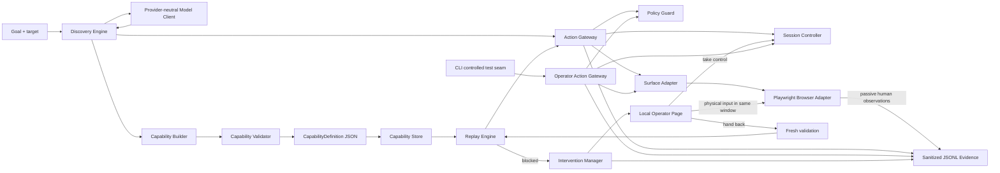

# System Design

## Reviewer narrative

Capability Runner has one required story:

1. **Discover** a workflow with a real model operating a real UI.
2. **Compile** the verified trace into a typed, reviewable capability.
3. **Replay** the capability in a fresh session without model decisions.
4. **Intervene** when policy or state prevents safe automation.
5. **Resume safely** on the same session after fresh validation and ownership transfer.

The implementation is a Python modular monolith. Its important property is not the number of
modules; it is that discovery, replay, and human actions share the same safety and session-control
boundaries.

## Control and data flow

### Discover

`DiscoveryEngine` receives a typed request, normalized surface snapshots, trusted semantic targets,
and a provider-neutral `ModelClient`. Model output is untrusted: JSON is parsed into strict
Pydantic decisions, unknown targets are rejected, fill values must originate in the goal, and
completion claims must match current trusted observations. The loop is bounded by turns, actions,
timeouts, invalid responses, and no-progress detection.

The model proposes; it never dispatches. Each action passes through `ActionGateway`, which resolves
a trusted profile binding, asks `PolicyGuard`, obtains a serialized automation dispatch lease from
`SessionController`, calls the injected `SurfaceAdapter`, and records policy/action evidence.

### Compile

`CapabilityBuilder` consumes only a verified discovery trace plus trusted authoring metadata. It
produces the same immutable `CapabilityDefinition` that Replay later interprets. The definition
contains schema and capability versions, application compatibility, typed inputs and outputs,
ordered action steps, semantic targets, bounded retries, success conditions, and declared business
outcomes. It contains parameter references rather than invocation values and no provider identity,
raw transcript, selector, browser handle, or executable code.

`CapabilityValidator` rejects unsupported or inconsistent definitions before `CapabilityStore`
publishes versioned JSON. The store is local and single-process; distributed publication is not
claimed.

### Replay

`ReplayEngine` binds validated inputs and interprets the saved steps without importing or invoking
the model layer. `StateEvaluator` classifies normalized snapshots and extracts declared outputs.
All mutations again pass through `ActionGateway`, so discovery and replay cannot diverge on policy,
target trust, session ownership, or evidence behavior.

Replay returns one of three terminal meanings:

- `SUCCESS`: terminal conditions are true and outputs were extracted.
- `BUSINESS_OUTCOME`: a declared domain result such as `MEMBER_NOT_FOUND` was observed.
- `FAILURE`: policy, target, state, timeout, input, session, or infrastructure prevented completion.

Recoverable observation waits are bounded internal paths, not a fourth terminal result. An action
whose effect is uncertain is never retried automatically.

### Intervene and resume

For approval-blocked Replay, the result carries an immutable checkpoint only when the action is
known not to have executed. The continuation coordinator retains protected invocation state in
memory and asks `InterventionManager` to transfer the existing session. The product shows a preview and transfers control of the existing headed browser.

The CLI controlled-action seam retains OperatorActionGateway. In the product, physical human
input goes directly to the same browser and is outside gateway policy; bounded passive events
record action kinds without field values or keystrokes. On handback, fresh semantic state is collected while
automation remains blocked. Session Controller issues a new generation only after validation.
Replay then checks terminal success first, otherwise proves whether the blocked step is complete;
it never trusts a pre-intervention snapshot or repeats earlier steps. A consumed continuation can
run only once.

## Core contracts

| Contract | Role | Safety property |
| --- | --- | --- |
| `ApplicationProfile` | Trusted entry point and semantic-to-surface bindings | Runtime/model input cannot authorize a target or route. |
| `CapabilityDefinition` | Agent-invocable replay contract | Strict, immutable, versioned, declarative, and free of invocation values. |
| `ReplayResult` | Caller-visible terminal result | Separates success, business outcome, and failure; identifies the failing step. |
| `ReplayCheckpoint` | Approval-only resume cursor | Exists only for `APPROVAL_REQUIRED` with `NOT_EXECUTED` effect state. |
| `SessionState` | Ownership and generation authority | Wrong-owner and stale-generation actions fail before dispatch. |
| `EvidenceEvent` | Structured durable event | Correlation survives; configured sensitive values are redacted before write. |

## Surface and tenant seams

The artifact names semantic targets and conditions; it does not embed Playwright selectors. A
profile binds those targets to ordered adapter-specific candidates. Replay and State Evaluator are
Playwright-free, so a legacy-browser or desktop adapter can implement the same opaque-session,
observe, inspect, act, and failure-evidence port without changing capability semantics.

For tenant reuse, a base capability identifies the vendor application family and compatible
variant. Tenant/version profiles should provide entry points, branding aliases, locator overrides,
and policy differences. Resolution should preflight compatibility, apply only narrow approved
overrides, fail closed on ambiguity, record per-variant outcomes, and quarantine repeated drift
rather than silently rewriting the base artifact. This is design only; no multi-tenant runtime
behavior is claimed.

## Evidence and privacy boundary

The implemented recorder appends sanitized JSONL events. Gateway events preserve run, session,
step, and action correlation while redacting secret wrappers, sensitive keys, and explicit runtime
values. Capability JSON stores types and references, not member IDs or balances from an invocation.

Current evidence limits matter:

- Discovery model decisions/rationale and Replay lifecycle/outcome events are not directly emitted.
- Terminal Discovery/Replay failures in the reviewer runtime invoke and persist a bounded,
  sanitized textual surface snapshot; screenshots and DOM archives are not persisted.
- Operator screenshots are bounded and ephemeral; they are not submission failure artifacts.
- Redaction is exact-value and key based, not semantic PII discovery.
- Evidence and continuation state are local, single-process, and not crash-recoverable.

## Deliberate cuts

No queues, clusters, distributed locks, production authentication, crash recovery, second surface
adapter, tenant runtime, general LLM fallback, generated code, or React product frontend are needed
to demonstrate the assignment core. The local operator page satisfies the assignment's explicit
minimal-handoff allowance. Submission work should expose and document the implemented vertical
slice before adding optional breadth.
