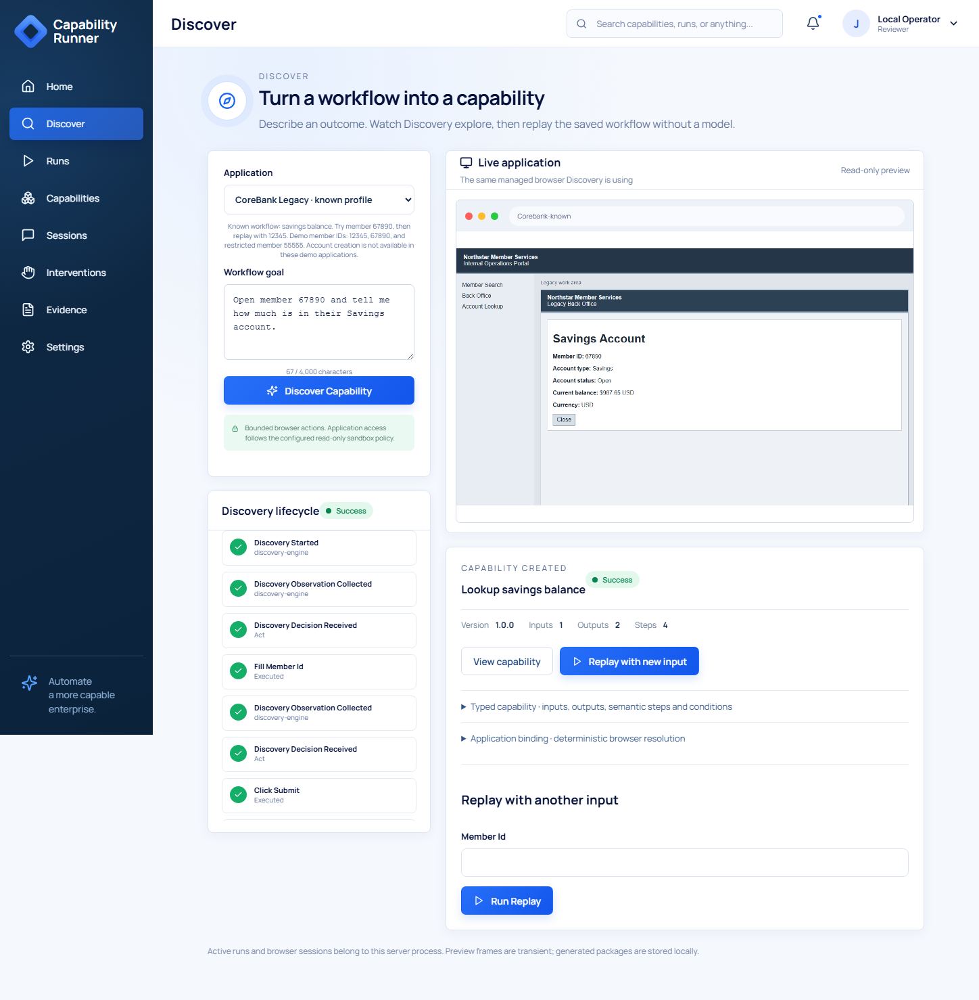
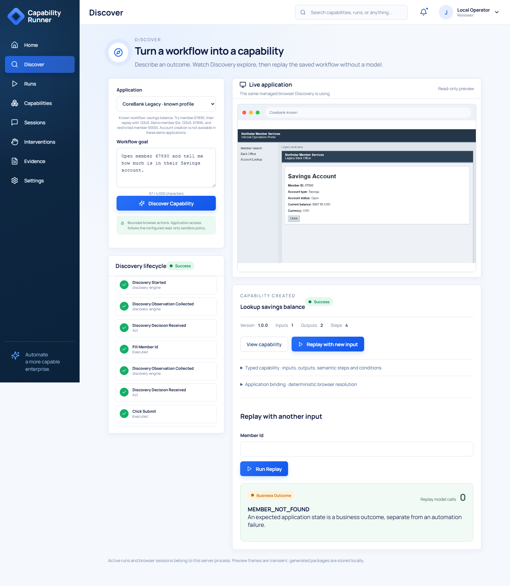
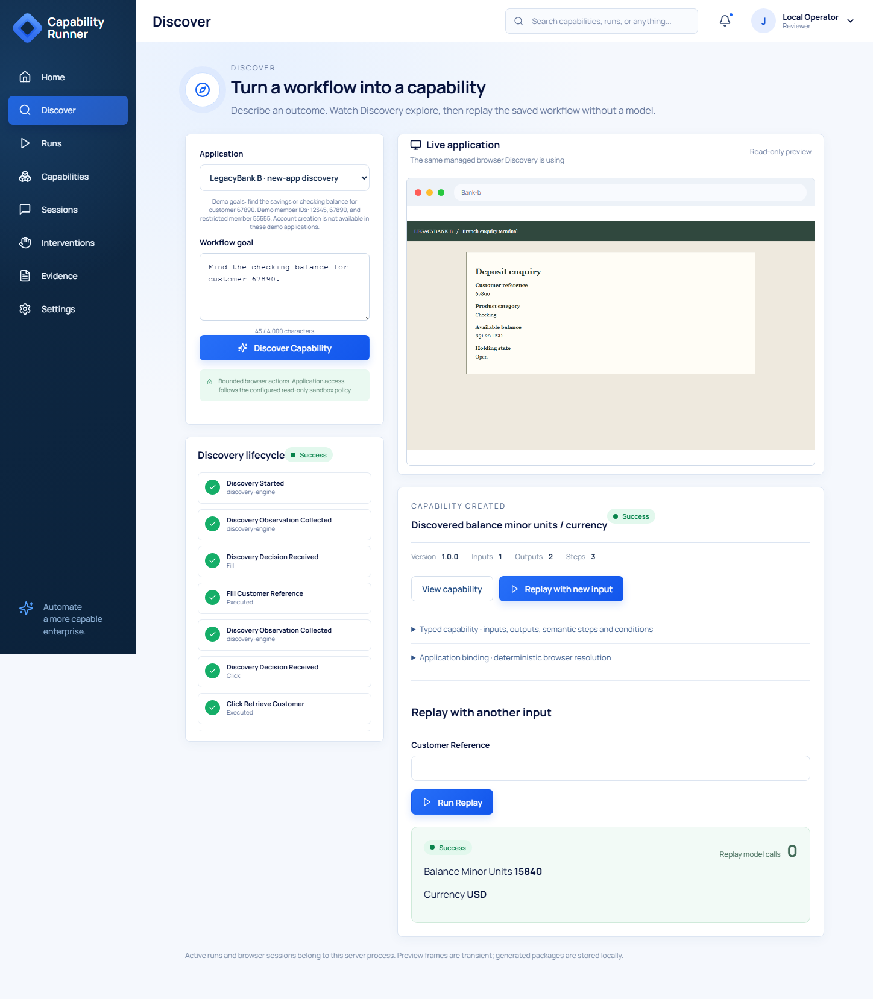
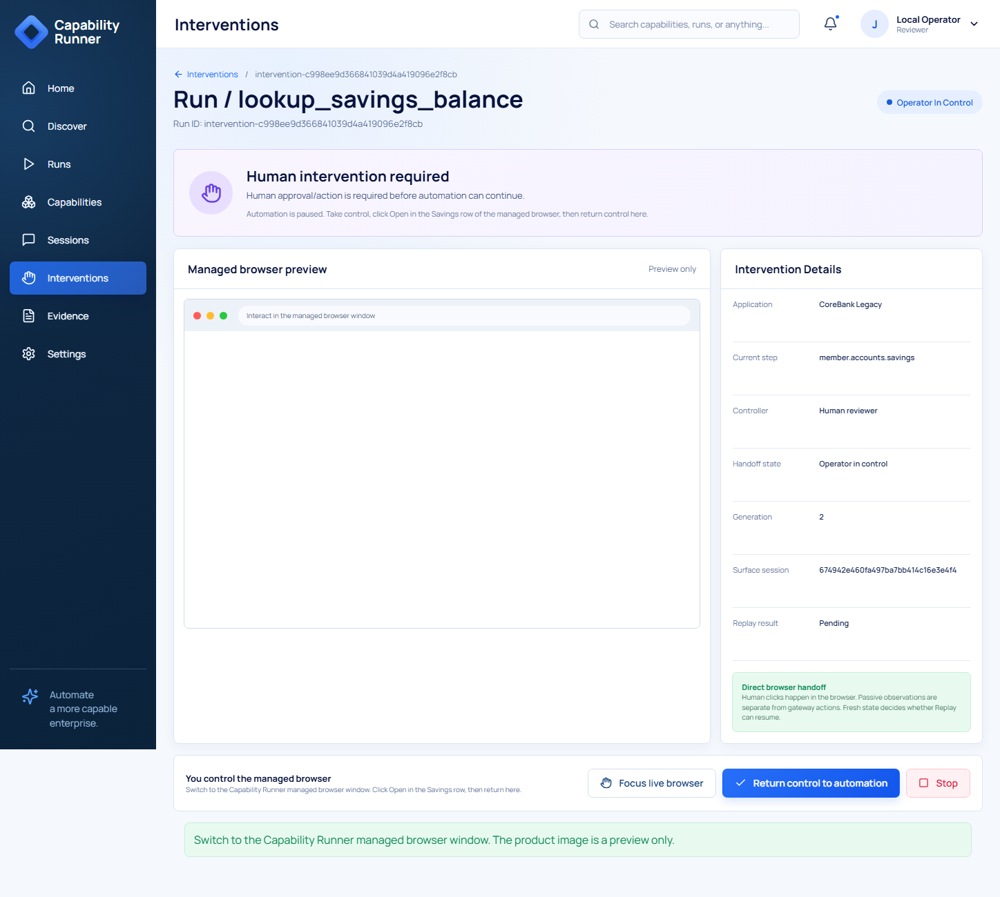
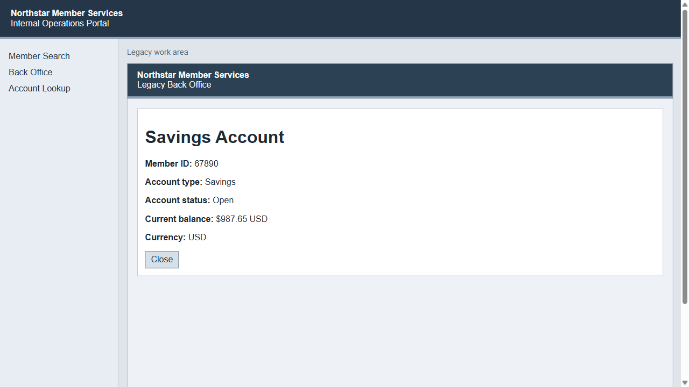
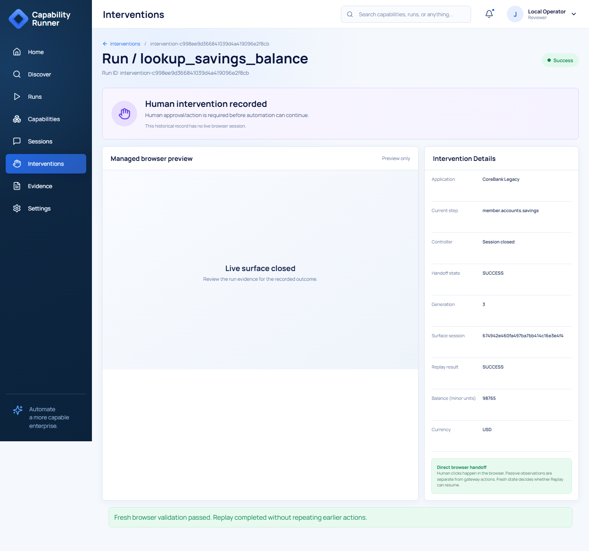
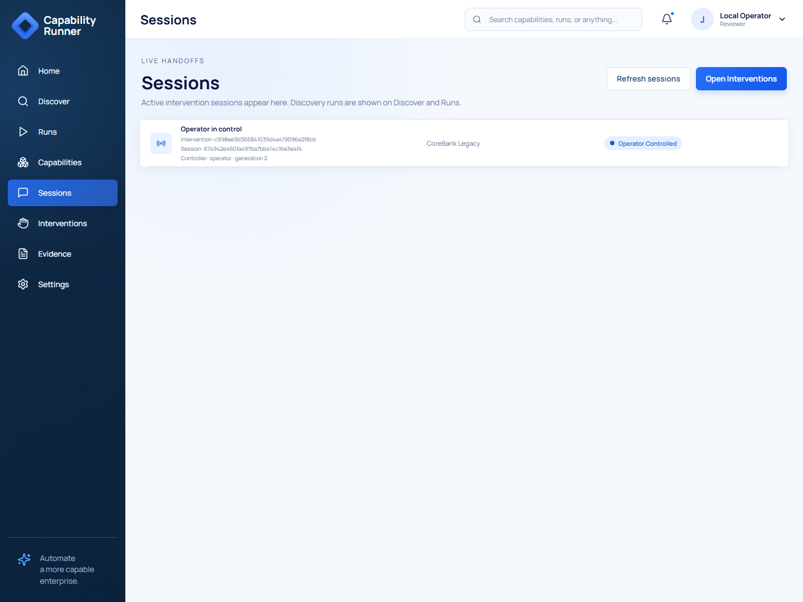
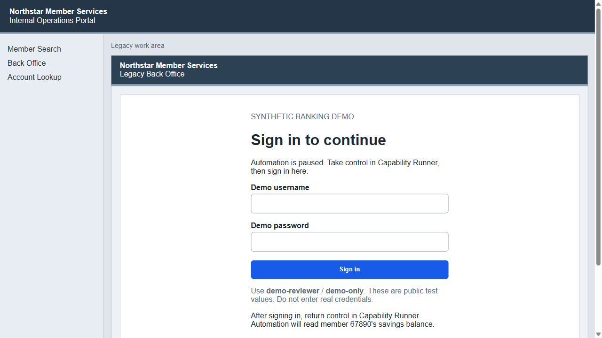

# Test the product with screenshots

Follow this path: **goal → Discovery → saved artifact → Replay → error → handoff**.
Allow 10–15 minutes plus setup. All members and balances are synthetic.
For more cases, use the [manual checklist](manual-test-guide.md).

## 1. Start it

From the repository root:

```powershell
uv sync --all-groups
uv run playwright install chromium
npm --prefix web ci
npm --prefix web run build
$env:CAPABILITY_RUNNER_BROWSER_HEADLESS = "false"
uv run capability-runner serve
```

Open **http://127.0.0.1:5000**. Configure one provider for Discovery using
[README setup](../../README.md#provider-configuration). Replay and handoff need no key.

Keep the server running. Restarting loses active sessions. After a rebuild,
hard-refresh old product tabs with **Ctrl+Shift+R**. Refreshing a tab preserves
the server session.

## 2. Discover a savings lookup and inspect its artifact

Choose **Discover → CoreBank Legacy · known profile**. Enter:

```text
Open member 67890 and tell me how much is in their Savings account.
```

Expect a changing browser preview and, on success, **Savings / $987.65 USD**
and **Capability created**. Inspect the input, outputs, steps and conditions.



This image came from a real provider run. Your provider may fail; the product
must show that failure instead of inventing an artifact.

## 3. Replay with a different input

Choose **Replay with new input → 12345 → Run Replay**.

Expect **SUCCESS**, **438221** minor units (**$4,382.21**), **USD**, and
**Replay model calls 0**. The Discovery preview still shows the original member;
Replay reports the new input separately.


Repeat with **00000**. Expect **BUSINESS_OUTCOME / MEMBER_NOT_FOUND**, no balance,
and zero model calls.



## 4. Verify a different banking outcome and interface

Choose **LegacyBank B · new-app discovery**. Enter:

```text
Find the checking balance for customer 67890.
```

Expect **Checking / $51.20 USD**. Replay with **12345** and expect
**15840** minor units (**$158.40**), **USD**, and zero model calls.



This app generates its own bindings. It does not prove one unchanged artifact
works across tenants. In the catalog, generic workflows are named **Discovered
balance minor units / currency**; inspect conditions to identify Checking.

Account creation is not implemented. Member 93604 does not exist.
Those requests must not become successful savings lookups.

## 5. Physically take over the existing browser

Use a local desktop. The embedded image is only a preview.

1. Open **Interventions → Start Demo Handoff**. Automation pauses before Savings.
2. Click **Take control**. Expect **Human reviewer**, **generation 2**.
3. Switch to the **managed Chromium window**. Use **Focus live browser** if needed.
   Click **Open** in the **Savings** row there.
4. Confirm **Savings Account**, member **67890**, and **$987.65 USD**.
5. Return to the product. Click **Return control to automation** and stop
   interacting with the managed window.

**Member Details is the starting page, not the finished step.** If you return
while the Savings and Checking rows are still visible, expect
`RESUME_STATE_UNVERIFIED` and no balance. The runner closes the browser after
that failed validation to end the attempt. Start a fresh handoff, open Savings,
and leave the Savings Account page visible before returning control.

Expect **SUCCESS**, **generation 3**, the same surface ID, and 98765/USD.
The browser closes after completion.







During takeover, **Sessions** shows this handoff. It becomes empty after completion.



If the button says **Return Control to Agent**, hard-refresh the old tab.
If the managed window is gone, click **Stop**, then start a fresh handoff.

These screenshots use automated Playwright input into the retained browser.
**Physical human acceptance is still pending.** Perform the steps yourself and
record the run ID, action and result. The [automated record](../../evidence/direct-browser/ui-check.json)
keeps that distinction explicit.

## 6. Check failure handling and evidence

### Sign-in handoff alternative

In Interventions, choose **Start Sign-in Handoff**, then **Take control**.
In the same managed Chromium window, sign in with the public test values
**demo-reviewer / demo-only**. Return control in the product.

Expect fresh authenticated-state validation, followed by the four automated
Savings lookup actions: **SUCCESS, 98765/USD, generation 3, zero model calls**.
No credential action is performed by automation. Wrong/no login must return
non-success without a balance. Finish or stop an existing handoff before
switching examples.



The product disables preview images for this credential-entry scenario.
This is a synthetic sign-in gate, not production authentication or general
session-expiry recovery. [Recorded checks](../../evidence/login-handoff/README.md)
use automated input; physical acceptance remains separate.

### Negative cases

Start a fresh handoff for each case:

| Your action | Expected result |
| --- | --- |
| Return without opening an account | Validation fails; no balance. |
| Open Checking instead of Savings | Wrong account rejected; no success. |
| Close the managed browser, then return | BROWSER_SESSION_CLOSED; no replacement. |
| Stop | Session ends without resumed success. |
| Return again after completion | Duplicate/inactive request rejected. |

Open **Evidence**. Check approval, ownership, return, fresh validation and the
final result. Human event capture is best effort; its count does not decide success.

| Assignment concern | Proof to inspect |
| --- | --- |
| Real Discovery and saved artifact | [Through-line log](../../evidence/through-line/evidence.jsonl) and [JSON](../../evidence/through-line/capabilities/lookup_savings_balance/1.0.0.json) |
| New-input Replay and business outcome | Step 3 |
| Different browser app | Step 4 and [checking record](../../evidence/checking/ui-summary.json) |
| Takeover and safe return | Steps 5–6 and [handoff log](../../evidence/direct-browser/evidence.jsonl) |
| Policy, stale requests, uncertain effects and privacy | [Harness checks](manual-test-guide.md#cli-and-evaluation) |
| Desktop/tenant design and cuts | [REPORT](../../REPORT.md) |

[Screenshot provenance](screenshots/README.md) identifies the runs.
Screenshots do not prove every negative case or production safety.
